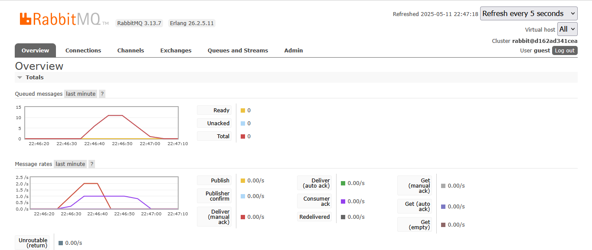

## 1. What is AMQP?
AMQP (Advanced Message Queuing Protocol) is a standard for message-oriented middleware that enables systems to communicate asynchronously by sending messages through brokers like RabbitMQ. It helps build scalable, decoupled, and reliable architectures by allowing producers to send messages without needing to know who the consumers are. With features like message queuing, acknowledgments, routing, and transactions, AMQP is well-suited for microservices and event-driven systems. It's like dropping a task into a shared to-do list, and one team member picks it up to complete — you don’t know who, but it gets handled.

## 2. What it means? guest:guest@localhost:5672 , what is the first guest, and what is the second guest, and what is localhost:5672 is for?
a. guest:guest — This part represents the username and password for authenticating with the RabbitMQ broker. The first guest is the username, and the second guest is the password. This is the default username/password for RabbitMQ unless changed.

b. localhost:5672 — localhost is the host address where RabbitMQ broker is running. In this case, it is our local machine. While 5672 is the port number where RabbitMQ broker is listening for AMQP conncections. 

- The large number of queues is caused by the high volume of messages sent by the publisher to the message broker, while not all of them have been processed by the subscriber, which is slower than the publisher. As a result, all unprocessed messages are stored in the queue. On my machine, the total queue count was 11. This happens because the subscriber takes longer to handle each event in the message queue, leading to a buildup of messages since the publisher publishes messages faster than the subscriber can process them.

